<style>

details {
  border: 1px solid #aaa;
  border-radius: 4px;
  padding: 0.5em 0.5em 0;
}

summary {
  font-weight: bold;
  margin: -0.5em -0.5em 0;
  padding: 0.5em;
}

details[open] {
  padding: 0.5em;
}

details[open] summary {
  border-bottom: 1px solid #aaa;
  margin-bottom: 0.5em;
}


</style>

# Making NTT convolution 10x faster with avx2


Hello everyone!

<!-- In this blog  -->
I want to share some of my thoughts and experiments on vectorizing NTT.

I prefer NTT to real-valued FFT because of the imprecision of the latter.
I use `avx2` because it is the most advanced vector extension supported by the majority of modern online judges (including Codeforces), as of 2024. 
And I have no idea how many bugs and how much UB my code contains, at least it passes some kind of tests.


### Benchmark info

All the benchmarks are performed on my `Ubuntu 22` `Intel i5-1135g7` laptop.
I execute `cpupower frequency-set -d 3.0ghz -u 3.0ghz` before benchmarks to (attempt to) fix CPU frequency for better accuracy. 
Code is available at [github](https://github.com/piskareviv/blog_aux_ntt_1).
You can try running all the benchmarks on your own machine with `run_all.sh` script.
Vertical dotted lines mark sizes of L1, L2 and L3 caches in `u32`s.


## The task

> Given coefficients of two polynomials $A(x), B(x) \in \mathbb{F}_{mod}[x]$, compute coefficients of $C(x) = A(x)B(x)$. Where $mod = 998\,244\,353$ (or other *sufficiently good* number).

Since it is accomplished by computing $A(x)B(x) \bmod (x^n - 1)$ (where $n$ is big enough power of two), we will focus on computing $A(x)B(x) \bmod (x^n - 1)$ for a given $n$. Such expression is also known as *cyclic convolution*.


## Step A, *standard* implementation

One of the most common implementations unrolls recursion into three nested `for` loops with the help of bit-reverse permutation.
This is what I consider the baseline.

The core of it looks like this

```cpp
void transform(int lg, u32* data) {
    for (int i = 0; i < (1 << lg); i++) {
        if (bit_rev[lg][i] < i) {
            std::swap(data[i], data[bit_rev[lg][i]]);
        }
    }
    for (int k = 0; k < lg; k++) {
        for (int i = 0; i < (1 << lg); i += (1 << k + 1)) {
            for (int j = 0; j < (1 << k); j++) {
                butterfly_x2(data[i + j], data[i + (1 << k) + j], w[k][j]);
            }
        }
    }
}
```


<details> 

<summary> More code </summary>


```cpp
void butterfly_x2(u32& a, u32& b, u32 w) {
    u32 a1 = a, b1 = mul(b, w);
    a = add(a1, b1), b = add(a1, mod - b1);
}
```

```cpp
void convolve_cyclic(int lg, u32* a, u32* b) {
    transform(lg, a);
    transform(lg, b);
    for (int i = 0; i < (1 << lg); i++) {
        a[i] = mul(a[i], b[i]);
    }
    transform(lg, a);
    std::reverse(a + 1, a + (1 << lg));
    u32 inv = power(mod + 1 >> 1, lg);
    for (int i = 0; i < (1 << lg); i++) {
        a[i] = mul(a[i], inv);
    }
}

```


</details>


[code](https://github.com/piskareviv/blog_aux_ntt_1/blob/master/A/ntt.hpp)


<details> 
<summary> Benchmark plot </summary>


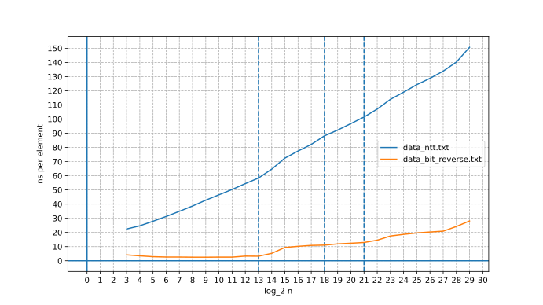


</details>


## Step A2, getting rid of bit-reversal

Applying bit-reverse permutation is somehow annoying, because

1. it is not useful work
2. it is one of the worst memory access patterns (probably even worse than random)
3. it is hard to speed up and vectorize

<!-- 4) (looking ahead) the *three nested loops* we will get will be easier to optimize than the *three nested loops* we currently have  -->

<!-- The most straightforward way to do so, is to perform all the calculations, but under assumption that our array is bit-reversed. -->
The simplest way to get rid of bit-reversal is just not doing it. <!-- but taking into account that the array is permuted. -->
Consider array elements as formal variables, permutation doesn't change their values, only their order in the array.
We will perform the same operations on the same variables, but their positions in the array will be different.


<details> 
<summary> Detailed explanation </summary>


At `k`-th iteration of the outermost loop we do the following:

1. Split all indices into pairs, such that two indices in a pair differ only in `k`-th bit
2. Perform `butterfly_x2` on each pair, where index of `w` is encoded by lower `k` bits 
of indices in pair.

If we reverse bits in array index, effect of `k`-th iteration becomes:

1. Split all indices into pairs, such that two indices in a pair differ only in `(lg - 1 - k)`-th bit
2. Perform `butterfly_x2` on each pair, where index of `w` is encoded by upper `k` bits 
of indices in pair, but now in reverse order.

It corresponds to the following code:

```cpp
void transform_forward(int lg, u32* data) {
    for (int k = 0; k < lg; k++) {
        for (int i = 0; i < (1 << k); i++) {
            u32 wi = w[k][bit_rev[k][i]];
            for (int j = 0; j < (1 << lg - 1 - k); j++) {
                butterfly_x2(data[(i << lg - k) + j], data[(i << lg - k) + (1 << lg - 1 - k) + j], wi);
            }
        }
    }
}
```

Let's optimize it a bit.
Instead of loading twiddle factors like this `w[k][bit_rev[k][i]]`, we will precompute `w[k]` in bit-reversed order and load it like this `w[k][i]`.
We may also notice, that arrays in `w` are now prefixes of each other, so we need only one array.

I substituted variables for shorter code, but workflow is still exactly the same.


</details>


```cpp
void transform_forward(int lg, u32* data) {
    for (int k = lg - 1; k >= 0; k--) {
        for (int i = 0; i < (1 << lg); i += (1 << k + 1)) {
            u32 wi = w[i >> k + 1];
            for (int j = 0; j < (1 << k); j++) {
                butterfly_x2(data[i + j], data[i + (1 << k) + j], wi);
            }
        }
    }
}
```


With such an approach output order of the `transform` function will be bit-reversed. It means nothing for pointwise product, but inverse transform has to be adjusted.
It is no longer possible to efficiently express inverse transform using forward. <!-- (it is possible with additional bit-reverse, one instead of three, but this is still bad). -->
But we always can invert any transform, just by inverting every operation performed in reversed order.
`butterlfy_x2` is just multiplication by invertible `2x2` matrix. 
Operations inside the two innermost loops are independent, so we need to reverse order of the outermost loop only.
I will not mention inverse transform for the next steps, because it will be very similar to forward.


[code](https://github.com/piskareviv/blog_aux_ntt_1/blob/master/A2/ntt.hpp)


<details> 
<summary> Benchmark plot </summary>


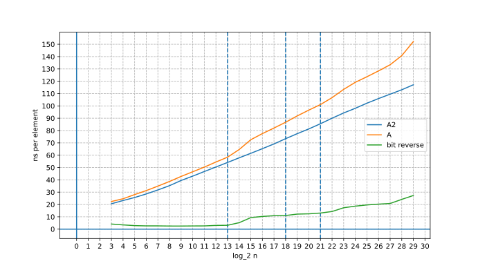


</details>


## Step A3, optimizing initialization to just $O(\log n)$


Note that new implementation loads the value of `w[i]` just $n - 1$ times, compared to $\frac{1}{2} n \log_2 n$ times for standard implementation
(we can swap two innermost loops and get the same $n - 1$ times, but memory access pattern will become awful).

It means that computing value of `w[i]` on fly (with one multiplication), instead of loading it from precomputed array, will not result in terrible performance decrease.
So to eliminate the need for an additional array of size $n$, we will use the value of `w[i]`, a precomputed array of size $\log_2 n$ and one multiplication to compute the value of `w[i + 1]`.

<!-- But  -->
To achieve that, we need to know what the entries of array `w` are. 
Let $g$ be the primitive root we are using.
Let $w_{2^k} = g^{\frac{mod - 1}{2^k}}$.
Let $F(s)$ denote the set of indices of all nonzero bits in $s$ (counting from $0$).
Then `w[i]` is equal to $\prod\limits_{k \in F(i)} w_{2^{k + 2}}$.

It's not hard to see that quotient `w[i + 1] / w[i]` depends only on number of trailing ones in binary representation of `i`.
We can compute these quotients for every number of trailing ones.
Then on every iteration of the middle loop we will:

1. compute number of trailing ones in `i` (with the help of `tzcnt` instruction)
2. multiply previous value of `w` by corresponding array element.

I think that having negligible initialization time and additional memory usage is cool
enough to justify mild performance decrease.


[code](https://github.com/piskareviv/blog_aux_ntt_1/blob/master/A3/ntt.hpp)
  
Initialization as is works in $O(\log^2 n)$, but it is still negligible.


<details> 
<summary> Fun fact </summary>


If we replace this line `u32 f = mul(a, power(b, mod - 2));` in constructor by this line `u32 f = mul(a, b);` (set `f` to `ab` instead of `a / b`),
`convolve_cyclic` function will still work correctly. I don't really understand why, didn't give it much thought. 


</details>


<details> 
<summary> Benchmark plot </summary>


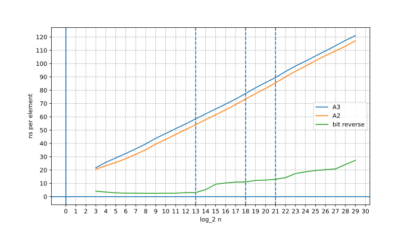


</details>


## Step B, utilizing Montgomery reduction


So far we have relied on compiler generated (for known in compile-time modulo) Barrett reduction.
To vectorize modular arithmetic we need to know it works, so on this step we will implement manual handling of all modular arithmetic. 
I will use Montgomery reduction, because vectorized version of it performed better than
vectorized version of any other reduction algorithm I tried (though there aren't many of them).


<details>
<summary> Quick explanation of Montgomery reduction </summary>


<!-- Meow. -->

Consider modular multiplication:

We have two integers $a, b \in [0, mod)$. We compute their product $x = a \cdot b$.
Now we want to bring $x$ back to $[0, mod)$. For some reason we want to do it by shifting $x$ 32-bits to the right (like `x >> 32`).
But by doing so we will discard some information about $x$, more precisely its lower 32 bits.
But maybe we can transfer all the information to higher bits (leaving 32 lower bits zeroed)?
Formally we want to find $y$, such that $y \equiv_{mod} x$ and $y \equiv_{2^{32}} 0$.
Chinese remainder theorem says, that there exists unique $y$, such that $0 \le y < 2^{32} \cdot mod$ (we assume that $mod$ is odd, since usually $mod$ is a big prime number).
One of its proofs gives us explicit formula: $y = x + \left(\left(x \cdot -\text{inv}(mod, 2^{32})\right)  \bmod 2^{32} \right)\cdot mod$.

Then we can safely shift $y$ 32 bits to the right. Let `r = y >> 32` be the result.
We know that $y < mod^2 + 2^{32} \cdot mod \implies r < mod + \frac{mod^2}{2^{32}}$. If $mod$ is less than $2^{32}$, then $r < 2 \cdot mod$. That means that we need conditional subtraction to reduce $r$ from $[0, 2 \cdot mod)$ to $[0, mod)$. 
<!-- But if $mod$ is less than $2^{30}$, than $[0, 2 \cdot mod) \times [0, 2 \cdot mod) \subset [0, 4 \cdot mod^2) \subset [0, 2^{32} \cdot mod)$. It means that even for $a, b \in [0, 2 \cdot mod)$ the result will be in the same interval $[0, 2 \cdot mod)$ -->

```cpp

// n_inv = -inv(mod, 2^32) % 2^32

u32 reduce(u64 val) const {
    return val + u32(val) * n_inv * u64(mod) >> 32;
}

u32 mul(u32 a, u32 b) const {
    return reduce(u64(a) * b);
}
```

> **There is a problem**: $r$ is not congruent to $x$ modulo $mod$, it is congruent to $x \cdot 2^{-32}$.
Lets instead of $a, b$ use their representatives in so-called *Montgomery space*: $a \cdot 2^{32}, b \cdot 2^{32}$. Then their *Montgomery product* `reduce(a * b)` will be $a \cdot 2^{32} \cdot a \cdot 2^{32} \cdot 2^{-32} = ab \cdot 2^{32}$ -- representative of $ab$ in *Montgomery space*.
This will require us to multiply all values by $2^{32}$ before performing computations and multiply by $2^{-32}$ after.


</details>

But Montgomery reduction has a problem. It divides by $2^{32}$ on each reduction.
There is a well-known solution of this problem called *Montgomery space*. 
But moving all array entries in and out of space will take too much time.

So we will do something about it. 
There are four places where we use multiplication:

1. In `butterfly_x2` function
2. For scaling result by $\frac{1}{n}$ 
3. For pointwise multiplication
4. For precomputing twiddle factors

I will call map $\mathbb{F}_{mod} \times \mathbb{F}_{mod} \to \mathbb{F}_{mod} \ \ \ \ a, b \mapsto ab \cdot 2^{-32}$ *Montgomery multiplication*.
I will say that variable $x$ is in *Montgomery space*, if the actual value stored is $x \cdot 2^{32}$.

If we multiply usual number and number from *Montgomery space* we will get usual number.
We multiply by twiddle factors in `butterfly_x2` only, so we will compute twiddle factors in *Montgomery space* 
and leave array entries usual numbers. `butterfly_x2` effect won't change.
This solves problem of twiddle factor precomputation as well.

We can scale the result using *Montgomery multiplication*, but we need to account for Montgomery reduction factor.
It can be done in $O(1)$ additional work, just by multiplying scaling constant by some precomputed factor.

Pointwise multiplication is a bit tricky, but we can cheat a little. 
If we use *Montgomery multiplication* for pointwise product $a \cdot b$ while keeping $a$ and $b$ usual numbers, the result will be off by a factor of $2^{-32}$.
But we can cancel that factor during scaling step in $O(1)$ addition work.
Though this approach won't work for non-homogeneous polynomials, like $2a - a^2b$ 
(this particular one is used in computation of inverse power series).


### Arithmetic usage optimization


Moduli are typically `30-bit` wide, and we can abuse that.
Instead of always having all numbers in $[0, mod)$, we will allow them to be in $[0, 2 \cdot mod)$ or $[0, 4 \cdot mod)$ and apply `shrink` when necessary (previously we would perform `shrink` immediately after addition/subtraction).
For `30-bit` moduli Montgomery reduction can reduce from $[0, 4 \cdot mod^2) \subset [0, 2^{32} \cdot mod) $ to $[0, 2 \cdot mod)$.
This allows us to reduce number of `shrink`s
(though we should be careful about it, it's very easy to place a bug while counting how many `shrink`s have to be applied)

```cpp
u32 shrink(u32 val) const {
    return std::min(val, val - mod);
}
```

This particular implementation of `shrink` may not be the most efficient one for scalar case, 
but I guess it the most efficient one for vector case, since both `u32` subtraction and minimum are natively supported by `avx2` (`_mm256_sub_epi32` and `_mm256_min_epu32` intrinsics).     

We may get rid of two layers worth of multiplications,
by noticing that all values of twiddle factors on topmost layer are ones, 
so multiplying by them is trivial (not required at all). So is half of twiddle factors on next layer,
quarter on layer after next, ..., and they add up to $1 + \frac{1}{2} + \frac{1}{4} + ... = 2 - \frac{2}{n} \approx 2$ layers.


Because the code is getting bloated by various optimizations, I will pack the innermost loop of `transform` function to a template parametrized function `transform_aux` to shorten the code.


Now we can use non-constexpr modulus. But there are some peculiarities.
I don't really know why, but if we don't save struct for Montgomery to a local variable (like this `const Montgomery mt = this->mt;`),
compiler will generate unnecessary load instructions for Montgomery constants in hot loops.


[code](https://github.com/piskareviv/blog_aux_ntt_1/blob/master/B/ntt.hpp) 


<details> 
<summary> Benchmark plot </summary>


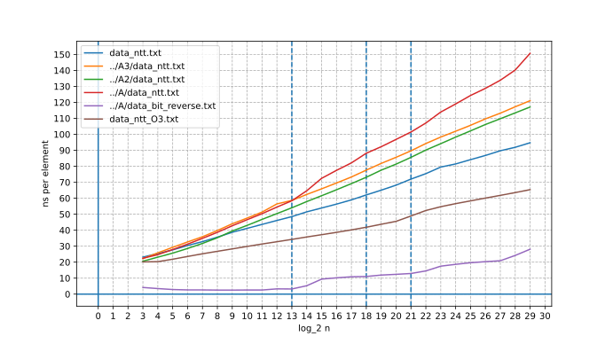

Compiler will already vectorize something with `-O3`,
but manual vectorization will be several times more performant.


</details>


## Step C, vectorization

### Vectorizing multiplication

Vectorizing multiplication is the most crucial step, since the majority of the performance improvement comes directly from it.
Yet I won't be comprehensive and will just show the best I could achieve, without explaining how and why.
I'll probably write a separate article later.


`n_inv` and `mod` are `u32x8`s filled with corresponding values from scalar Montgomery. 
`mul_u32x8` computes pointwise *Montgomery product* of input vectors.
 <!-- `reduce` is separated, because we will need it later. -->

```cpp
u32x8 reduce(u64x4 x0246, u64x4 x1357) const {
    u64x4 x0246_ninv = _mm256_mul_epu32(x0246, n_inv);
    u64x4 x1357_ninv = _mm256_mul_epu32(x1357, n_inv);
    u64x4 x0246_res = _mm256_add_epi64(x0246, _mm256_mul_epu32(x0246_ninv, mod));
    u64x4 x1357_res = _mm256_add_epi64(x1357, _mm256_mul_epu32(x1357_ninv, mod));
    u32x8 res = _mm256_or_si256(_mm256_bsrli_epi128(x0246_res, 4), x1357_res);
    return res;
}

u32x8 mul_u32x8(u32x8 a, u32x8 b) const {
    u32x8 a_sh = _mm256_bsrli_epi128(a, 4);
    u32x8 b_sh = _mm256_bsrli_epi128(b, 4);
    u64x4 x0246 = _mm256_mul_epu32(a, b);
    u64x4 x1357 = _mm256_mul_epu32(a_sh, b_sh);
    return reduce(x0246, x1357);
}
```
(type casts are omitted)

It uses just 12 instructions, six of which are multiplications, 
with the longest dependency chain having latency of 18 cycles, with 3 multiplications (latency 5) and 3 other instructions (latency 1) on it.


<details>
<summary> Explanation </summary>


First we split input `u32x8`s into odd and even indices.
Now we have 64-bit word for each element at our disposal,
and we can perform Montgomery reduction similarly to scalar case, but now vectorized.
Then we combine results for odd and even indices into a singe `u32x8`.

We don't have a variety of multiplication instructions. 
Only `_mm256_mul_epi32`, `_mm256_mul_epu32` and `_mm256_mullo_epi32` may be somehow suitable 
(I refer to instructions by corresponding intrinsics).
Here we use only `_mm256_mul_epu32`, which is `u32` by `u32` to `u64` multiplication.
More precisely it splits 256-bit register into four 64-bit words, takes lower 32 bits of each word (discarding upper 32), multiplies corresponding 32-bit values (as unsigned integers) from two input registers and stores produced 64-bit result in corresponding 64-bit word of output register.

`_mm256_bsrli_epi128(a, 4)` shifts each of two 16-byte blocks of 32-byte vector 4 bytes to the right. 
I prefer it to 64-bit shift `_mm256_srli_epi64(a, 32)` (which may seem more relevant) for performance reasons, 
more precisely it is better in terms of resource interference (especially on older CPUs).
There (typically) are three ports (execution units) for `avx2` instructions `p0`, `p1` and `p5`.
On older CPUs (vector) multiplication can be executed on `p0` only. 
Because we have a lot of multiplications, `p0` is under heavy load. 
And `_mm256_srli_epi64`, like multiplication, can also be executed on `p0` only.
If we used `_mm256_srli_epi64`, we would have 9 out of 12 instructions executed on `p0` (6 multiplications + 3 bit shifts).
This will result in all load being put on `p0`, while `p1` and `p5` are almost idle.
`_mm256_bsrli_epi128` is executed on `p5`, and we redistribute load from `p0` to `p5` by using it instead of 64-bit shift.

Such replacement is possible because 

1. `_mm256_mul_epi32` discards upper 32-bits of each 64-bit word, so first two usages are fine
2. Montgomery reduction leaves lower half of 64-bit words zeroed, so third (the last) usage is also fine


The latter is also the reason why we can use `or` (or any other bit combining operation) instead of `blend`.


<!-- Nya. -->


</details>


**Note**: it is also possible to implement `mul_u32x8` with Barrett reduction, but all of my attempts were slower by at least 20-30%.
It may be reasonable to use Barrett reduction for pointwise product part when Montgomery reduction factor can't be easily removed.


### Back to our algorithm

I will call outer loop iterations in `transform` function for `k >= 3` top layers, 
and all the other outer loop iterations (for `k < 3`) bottom layers.

Using our `mul_u32x8` in top layers is trivial, because we operate on consecutive segments of data of at least 8 `u32`s (register size).
But for bottom layers things get complicated, we now have to deal with in-register shuffles. So top and bottom layers are now split into separate loops.

Let's implement `butterfly_x2` in a way friendly to vector operations.
We are performing transform on values `a`,`b` stored in vector `[a, b]`.

1. Multiply `[a, b]` by vector `[1, w]` pointwise: `-> [a, b * w]`
2. Create a copy of `[a, b * w]` where `a` and `b * w` are swapped: `-> [b * w, a]` (in-register shuffle is used)
3. Negate `b * w` in `[a, b * w]` (by negating all and blending): `-> [a, -b * w]`
4. Add vectors `[a, -b * w]` and `[b * w, a]` pointwise: `-> [a + b * w, a - b * w]`

We use this approach to simultaneously perform four `butterfly_x2` on 8 consecutive elements.

For `k = 2` our `u32x8` will look like `[a1, a2, a3, a4, b1, b2, b3, b4]`.

For `k = 1` our `u32x8` will look like `[a1, a2, b1, b2, a3, a4, b3, b4]`.

For `k = 0` our `u32x8` will look like `[a1, b1, a2, b2, a3, b3, a4, b4]`.

(we are applying `butterfly_x2` to pairs `(a_i, b_i)`)


We won't separate loops iterations for `k = 0, 1, 2`, and will just apply all of them at once to each block of 8 consecutive `u32`s. 
With approach like this we can easily vectorize recalculation of twiddle factors by packing
all $1 + 2 + 4 = 7$ of them to a single `u32x8` and updating simultaneously with one `mul_u32x8`.
The latter is quite important, since amount of twiddle factor recalculation grows exponentially with layer *depth* and by vectoring it at the bottom layers we vectorize about $\approx \frac{1}{2} + \frac{1}{4} + \frac{1}{8} = 87.5\%$ of all recalculations.


[code](https://github.com/piskareviv/blog_aux_ntt_1/blob/master/C/ntt.hpp) 


<details> 
<summary> Benchmark plot </summary>


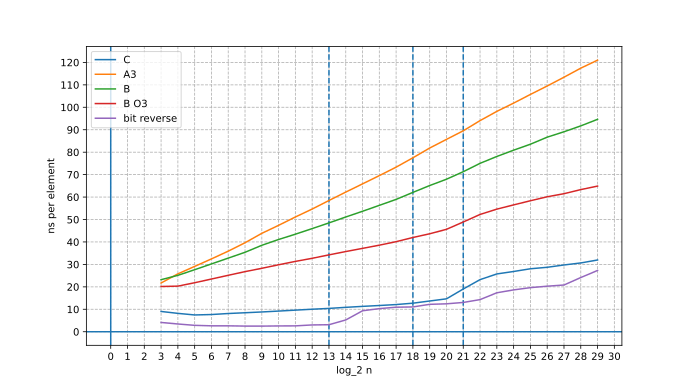


</details>


## Step D, radix4 butterfly


We made the computational part of our algorithm 5-10x faster, but I/O can't keep up, 
and our algorithm gets bottlenecked by memory bandwidth for large arrays ($n \ge 2^{20}$), even though memory access pattern is linear.
Now we are going to reduce this slowdown.

One of the possible solutions is to perform two layers simultaneously (with radix4 butterfly),
this halves the number of memory scans and reduces speed of scanning twofold
(since we are now doing two times more computation per byte loaded).
 
We implement `butterfly_x4` by simply stacking four `butterfly_x2` onto each other.

Since the number of top layers may or may not be odd, we need to add one conditional `butterfly_x2` layer.
I choose the topmost layer, because it is simplest to implement (all twiddle factors are ones).

Another benefit of radix4 butterfly is the ability to (easily) vectorize recalculation of twiddle factors.
Now each `butterfly_x4` requires three different twiddle factors, so we can pack them to a single `u64x4` and update simultaneously (like we did in bottom layers).
If not for that, there would be almost no performance improvement (compared to radix2) for arrays fitting in L1 or L2 cache (at least on my machine).


[code](https://github.com/piskareviv/blog_aux_ntt_1/blob/master/D/ntt.hpp)


<details> 
<summary> Benchmark plot </summary>


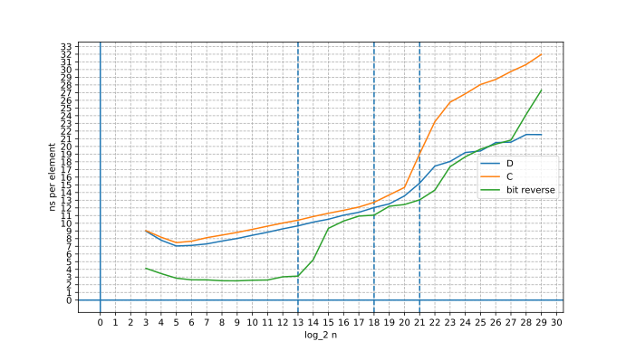


</details>


 
## Step E, optimizing bottom layers

Bottom layers are really slow, 3 bottom layers take as much time as 10 top layers (probably because we didn't vectorize them properly).
(Back in November 2023) I had been wondering how I could make them faster for quite a while, when I found [this](https://codeforces.com/blog/entry/117947) blog by `[user:pajenegod]` 
It clearly shows what exactly the code we got at step A2 is computing.
Moreover, it suggests switching to $O(n^2)$ multiplication when we are running out of square roots.
But there may be another reason for switching to $O(n^2)$ algorithm, it can simply be faster than $O(n \log n)$ algorithm for small values of $n$.
And this is exactly the case. 

Before bottom layers, we already have computed $A(x) \bmod (x^8 - w_i)$ and $B(x) \bmod (x^8 - w_i)$ for every $i$ from $0$ to $\frac{n}{8}$.
But now, instead of going deeper, computing values of $A(x), B(x)$ at the roots of $x^8 - w_i$, 
multiplying them pointwise and retrieving $A(x)B(x) \bmod (x^8 - w_i)$ from its values at those roots,
we will multiply $A(x) \bmod (x^8 - w_i)$ by $B(x) \bmod (x^8 - w_i)$ modulo $(x^8 - w_i)$ straight away.


<details>
<summary> implementation details </summary>


It's hard to properly utilize ILP while doing only single multiplication $\bmod (x^8 - w_i)$, so we will do several such multiplications in *parallel* when possible.
More precisely we will interleave computations involved in two or four such multiplications.

At previous step we switched to `radix4` butterfly, but number of top layers can be odd, so we may need to perform additional `radix2` layer.
But now it is possible to adjust the number of top layers by switching to $O(n^2)$ algorithm one layer earlier, so we can get rid of that `radix2` layer.

Here we optimize computation of sum of products 
by doing $\left( \sum_i a_i \cdot b_i \right) \ \%\ mod$ 
instead of usual $\sum_i \left( a_i \cdot b_i\ \%\ mod \right)$
Instead of reducing every product, we compute sum of products and perform a single reduction for that sum.
This is important, since modular reduction is several times more costly than usual `32 x 32 -> 64` multiplication.

For some reason the compiler won't generate good enough code for this function without `O3` optimization level, so I enabled it specifically for this part using `__attribute__((optimize("O3")))`.


<!-- Scalar version of the code:

```cpp
// ...
``` -->


</details>


[code](https://github.com/piskareviv/blog_aux_ntt_1/blob/master/E/ntt.hpp)


<details> 
<summary> Benchmark plot </summary>


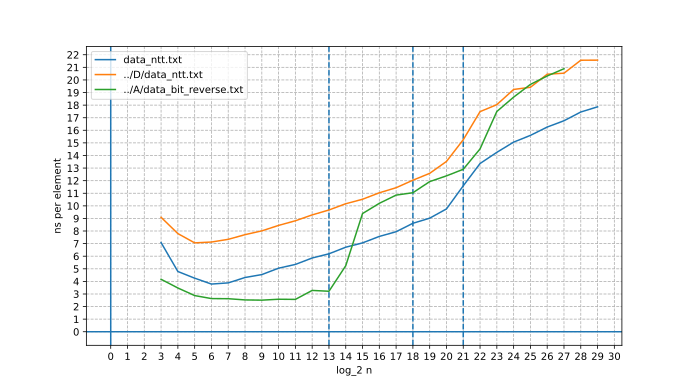


Now top and bottom layers are roughly equal (in terms of time per level), if you draw a line through part from $7$ to $20$ (before slowdown caused by memory throughput affects performance), it will almost pass through origin.


</details>


But switching to $O(n^2)$ multiplication at bottom layers has downsides. 
If we need to perform heavy computation with the output of NTT,
we will have to perform operations $\bmod (x^8 - w_i)$ instead of doing them just pointwise.


## Step F, recursive computation order


Now we are going to improve cache optimality even further.
After finishing the topmost `radix4` layer, we get four independent parts, 
so we can perform computation for each part recursively. 
With recursive order only several topmost layers will be affected by memory bandwidth slowdown.


<!-- We can do it with explicit recursion, because we only need it for several topmost layers. -->
<!-- But we can implement it in a fancy way: unroll recursion to a for loop by storing stack state in a bitmask.
I first saw this idea in [this](https://judge.yosupo.jp/submission/201990) submission, 
but there is a way to do similar thing simpler and faster. -->

We can try explicit recursion, it won't introduce much of an overhead, because we only need it for several topmost layers.
We can try unrolling recursion into a `for` loop by storing stack state in a bitmask.
But there is another, simpler and more efficient way to make computation (fully) recursive without much of an overhead,
I first saw it in [this](https://judge.yosupo.jp/submission/201990) submission.

We will examine `radix2` case first, generalizing approach to `radix4` will be very simple.
Let's visualize computational order as a tree, where nodes are recursive calls.

During each recursive call exactly one `aux_transform` is performed, and it is performed on a half of subarray of the parent node.
Previous order executed `aux_transform` first by depth in the tree, then by order from left to right.
Now we want to do it in recursive order.

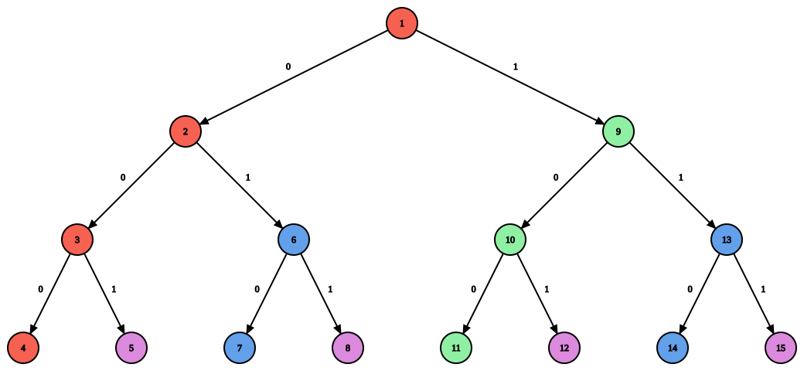

We may notice a pattern: if we ascend from a leaf node using `0` edges only, we will traverse a consecutive segment of recursive calls (these paths are marked with color). 
So let's iterate over leaf nodes, ascend until we meet a `1` edge, and perform corresponding transforms in nodes of traversed path (we need to perform them from top to bottom).
Length of the path can be calculated with the help of `tzcnt` instruction -- it is exactly number of trailing zeros in binary representation of leaf index.
Order of `aux_transform` calls is still consecutive at each layer, so twiddle factors will be updated correctly.
Leftmost path will be a special case, since all `aux_transform` calls on it will have twiddle factors of one. 

Inverse transform can be made fully recursive similarly, but we ascend by `1` edges, instead of `0` edges.


> **Note**: I don't really know if `radix8` is an option, there might be issues with it, such as lack of logical registers (`avx2` has only 16), enormous (machine) code size (~220 instructions per butterfly, don't really know if it matters)
and the (counterintuitive) fact that it (and higher radix transforms) might be less I/O optimal because of the way cache associativity works.


[code](https://github.com/piskareviv/blog_aux_ntt_1/blob/master/F/ntt.hpp)


<details>
<summary> Benchmark plot </summary>


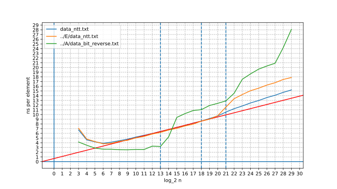


Now the plot looks straight, but it actually isn't. 
If you draw a line through unaffected part (or simply put an edge of a paper sheet to your screen), 
it will become clear that after the second vertical line (L2 cache) angle changes a little,
and at `n = 2^29` recursive order is two-three times closer to that line than usual order.
This is what we should expect, because for recursive order only one third of layers is affected (for sizes greater than $2^{20}$), whilst for usual order all layers are affected.


</details>


<details>
<summary> further I/O efficiency improvements </summary>


<!-- https://judge.yosupo.jp/submission/176389 -->

This part is based on my previous experiments, so there is no code for it, but workflow was pretty similar. 

When memory bandwidth is a bottleneck, reduction in it can cause performance to degrade even more.
My CPU has 4 cores, what if we run our code on all four cores in parallel?


For arrays that fit in L2 cache it makes no difference whether we run convolution on a single core or four convolution on all four cores simultaneously.
But for larger array performance of parallel version degrades quickly. 
At the rightmost point `n = 2^28`, parallel version is almost two times slower.

I tried using `radix64` on blocks of size `1024` (so one such transform acts on $1024 \cdot 64 = 65536$ elements in total) using three layers of `radix4` (we use *`radix64`* only when array doesn't fit in L2 cache).
It did help, but I don't actually know why.
I guess it's mainly because of L3 cache. Unlike L1 and L2 caches, L3 is capable of caching all $65536$ elements (not because of size, but because of the way it works). 
Even though L3 is much slower than previous levels of cache and is shared between cores, it is still faster than main memory.

Check part from line 891 to line 989 of [this](https://judge.yosupo.jp/submission/176389) submission for implementation details, 
it isn't the exact code, but it's pretty similar to the one used in benchmark.

<details>
<summary> benchmark plot </summary>


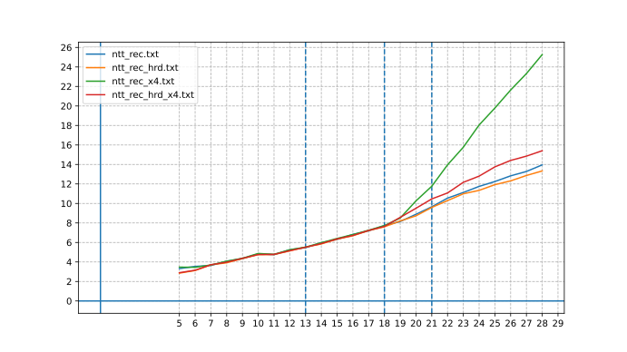

Suffix `_x4` means that code is run in parallel on four cores.
Suffix `_hrd` means that code uses that *`radix64`* transform.


</details>


There might be ways to improve I/O optimality even further, but this blog is already too large.
Some of them may involve permuting array elements or inserting *holes* to make caching all elements of higher radix transform in `L1` or `L2` possible.


</details>


## Final result


<details>
<summary> ratio plot </summary>


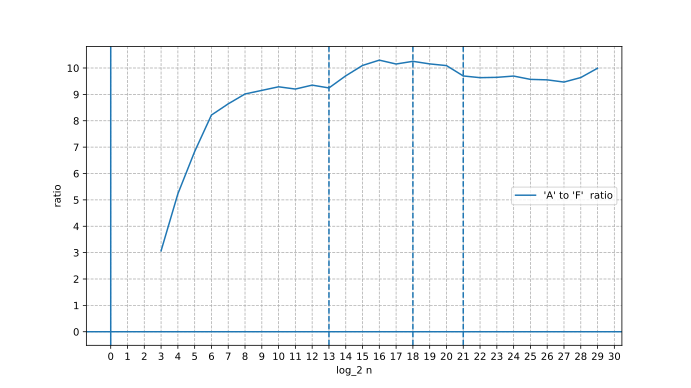


</details>

Now our convolution is 9-10 times faster than the original one.
There are still things to improve, but doing so is rather complicated and won't give much of an improvement.

<details>
<summary> Examples </summary>


- Precompute `b * n_inv` for Montgomery multiplication if `b` is known in advance, to move one multiplication off longest dependency chain
- Use different `radix4` implementation (factor common divisor of `w1`, `w2` and `w3` and rearrange computation a bit)
- Optimize $O(n^2)$ algorithm for bottom layers even better
<!-- -  -->


</details>


We can submit it to [this problem](https://judge.yosupo.jp/problem/convolution_mod) and get very [close](https://judge.yosupo.jp/submission/279317) to top1 solution.
(we need to steal fast I/O template from top1 submission for fair comparison)

Execution time measured by the system includes time for reading input data and printing output data.
And even with custom fast I/O, it takes several times more than the convolution itself.
So, to measure actual computation time more accurately, one needs to do it by himself and print the result to `stderr` 
(luckily the judge shows `stderr` on every test). 

Our submission uses `~7.0ms` for actual computation (of cyclic convolution of size $2^{20}$). 
Author of [top1 submission](https://judge.yosupo.jp/submission/199421) (as of 17 Aug of 2024) also printed actual computation time to stderr, his submission uses `~6.5ms`.
And [this](https://judge.yosupo.jp/submission/201990) submission (by the same author) uses just `~6.05ms`, though it doesn't have fast I/O and runs in more `100ms` in total.


<!-- 
### How to use [F](https://github.com/piskareviv/blog_aux_ntt_1/blob/master/F/ntt.hpp)

First you need to construct an instance of class `NTT` like this `NTT(998244353)`,
`mod` is not required to be a compile-time constant, but `mod` should be prime.

Then there are 4 methods available:


- `transform_forward(lg, a)` 
- `transform_inverse(lg, a)`
- `aux_dot_mod(lg, a, b, c)`
- `convolve_cyclic(lg, a, b)` 


- `transform_forward(lg, a)` -- perform forward transform on first `2^lg` elements of `a`
- `transform_inverse(lg, a)` -- perform inverse transform on first `2^lg` elements of `a`
- `aux_dot_mod(lg, a, b, c)` -- use this instead of pointwise multiplication. Writes result to `c`, doesn't change `a`, `b`
- `convolve_cyclic(lg, a, b)` -- performs cyclic convolution of first `2^lg` elements of `a` with first `2^lg` elements of `b`. Writes result to `a`, alters `b`


All passed pointers must be `32-byte` aligned, `lg` -- base-two logarithm of `n`, must be at least 3.
Allocating aligned memory with `_mm_malloc` is quite convenient, don't forget to call `_mm_free` afterwards.

If you need just convolution, use `convolve_cyclic`.

If you need more sophisticated NTT stuff, 
use `transform_forward` and `transform_inverse` for forward and inverse transform correspondingly,
and `aux_dot_mod` instead of pointwise multiplication. 
Multiplying intermediate representation by constant is unchanged, adding two intermediate representation is unchanged (since everything is linear). But adding constant to intermediate representation is a bit complicated. 


Computing $2a - a^2 b$:
<details>

<summary> code </summary>


```cpp
transform_forward(lg, a);
transform_forward(lg, b);

aux_dot_mod(lg, a, a, c);  // c = a^2
aux_dot_mod(lg, b, c, c);  // c *= b

// c = 2a - c  (elementwise)
for (int i = 0; i < (1 << lg); i++) {
    c[i] = (2 * (a[i] % mod) + (mod - c[i] % mod)) % mod;
}

transform_inverse(lg, c);
```


</details> 

-->
